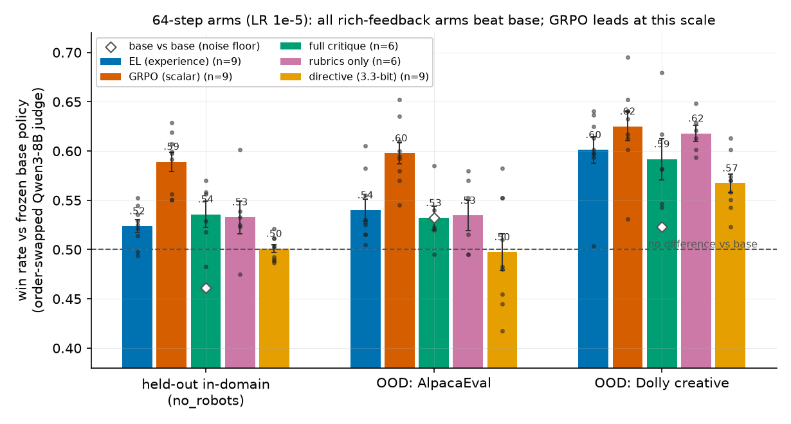
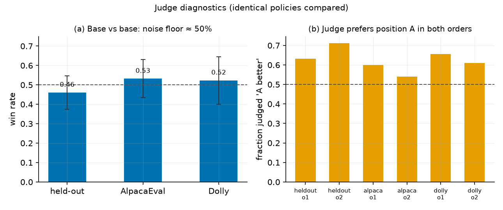
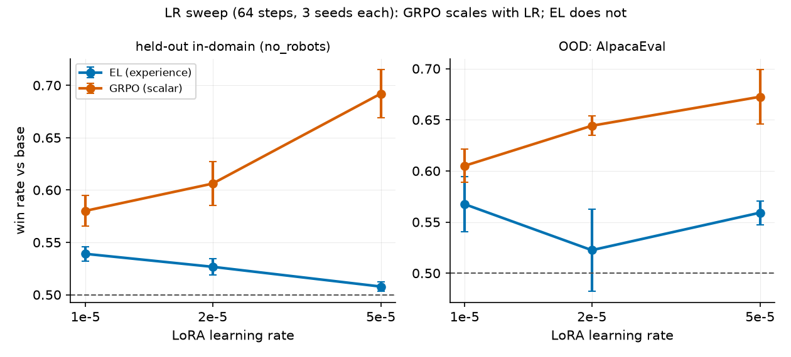
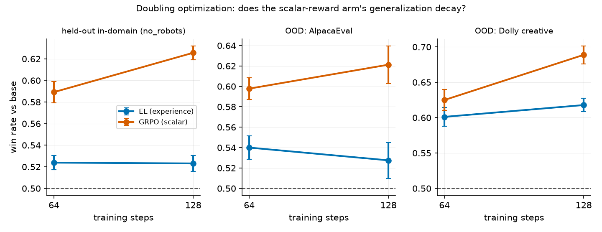
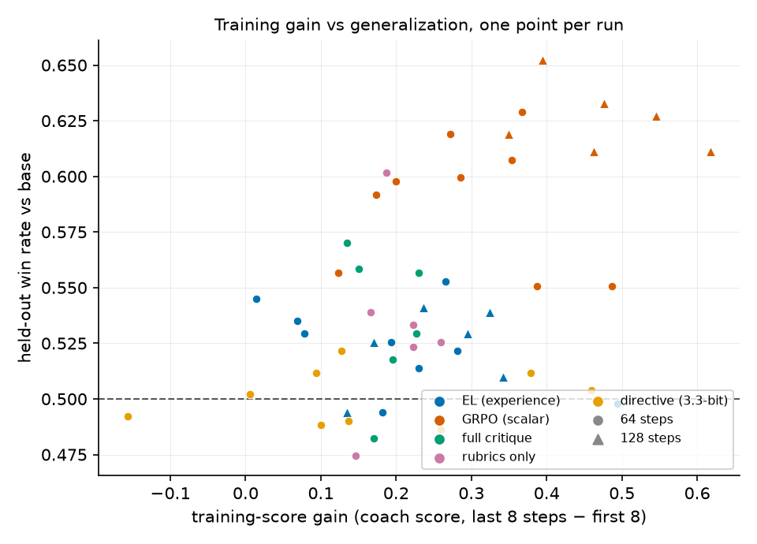

# Does textual "experience" beat a scalar reward? A downscaled reproduction of LLM-as-a-Coach (arXiv 2607.18110)

**Verdict: partially reproduced.** In a matched, 64-run comparison at 1.5B scale, the paper's low-bandwidth prediction holds — feedback quantized to ~3.3 bits produces almost no held-out gain — but its headline result does not: scalar-reward GRPO consistently *out*-performed experiential-learning distillation on held-out and out-of-distribution prompts (9 paired seeds, t ≈ 4–5), showed no sign of the predicted generalization decay when training was doubled, and widened its lead across a 5× learning-rate sweep. This tests the mechanism at 1.5B with LoRA, not the paper's 7–8B full fine-tuning scale.

**How to read this figure.** Every arm starts from Qwen2.5-1.5B-Instruct and trains on the same 512 open-ended prompts with feedback from the same frozen coach model; bars show how often a held-out judge prefers the trained policy over the untrained base (order-swapped, so 0.5 = no improvement; white diamonds show the base-vs-base noise floor; dots are individual seeds). All rich-feedback arms beat the base. But the orange scalar-reward arm (GRPO) leads the blue experience-distillation arm (EL) on the in-domain held-out set and both unseen OOD sets — the opposite of the paper's headline ordering. The yellow directive arm, whose feedback is compressed to one of ten canned sentences (~3.3 bits, the same bandwidth as a 1–10 score), is the only arm at the noise floor in-domain — the part of the paper's bandwidth story that does survive.

## The question

For open-ended tasks with no checkable answer (writing, explanation, brainstorming), LLM post-training typically asks a judge model to score responses against a rubric, then optimizes the scalar score with RL. The paper argues this discards most of the judge's information: a 1–10 score carries ~3.3 bits, while the judge's textual analysis carries kilobits. Their fix — *Experiential Learning* (EL) — asks the judge (now a "coach") to distill its critique into transferable advice inside `<experience>` tags, conditions a frozen copy of the initial policy on that advice to form a teacher distribution, and trains the policy to match the teacher token-by-token (reverse KL over the student's top-256 tokens) on its own on-policy samples. The claims tested: (1) EL beats matched scalar-reward RL on held-out response quality; (2) EL transfers better, while RL's training gains partly fail to generalize; (3) extracted experience beats lower-bandwidth or unstructured feedback contexts.

## The setup (downscaled, everything matched across arms)

Policy: **Qwen2.5-1.5B-Instruct** with LoRA (r=32). Coach: frozen **Qwen2.5-7B-Instruct**, one call per sampled response returning a critique, a 1–10 score, and an `<experience>` extraction — every arm consumes the *same* coach output and differs only in which part it learns from:

| arm | learning signal | ~bandwidth |
|---|---|---|
| `grpo` | scalar score → group-normalized REINFORCE (GRPO) | 3.3 bits |
| `el` | experience text → teacher context → reverse-KL distillation | kilobits |
| `full_critique` | whole critique as teacher context | kilobits |
| `rubrics_only` | rubric text as teacher context | kilobits |
| `directive` | 1-of-10 canned directive as teacher context | 3.3 bits |

Training: 512 real open-ended prompts (no_robots Generation/Open-QA/Brainstorm categories), 64 steps × 16 prompts × 4 samples (2 epochs), identical LR, batch schedule, and optimizer-step count everywhere. Evaluation is deliberately held out from the training signal: **Qwen3-8B** (never seen during training) judges the trained policy against the frozen base pairwise on 128 held-out in-domain prompts, 100 AlpacaEval prompts, and 64 Dolly creative-writing prompts, every pair judged in both presentation orders.

## Finding 1 — the judge needed de-biasing, and the harness proves it

Comparing the *identical* base policy against itself, the judge picks "Response A" about 2:1 *regardless of order*. Averaging the two orders cancels this: base-vs-base lands at 0.46–0.53 across the three sets, the noise floor all treatment effects are read against. This diagnostic came from the baseline reference run and validated the evaluation before any arm was compared.

## Finding 2 — scalar GRPO wins the matched comparison, robustly

Across 9 paired seeds at the default LR, GRPO beats EL on every set: held-out 0.589 vs 0.524 (paired t = 4.4), AlpacaEval 0.598 vs 0.540 (t = 5.4), Dolly 0.625 vs 0.601 (t = 3.2). EL reliably improves over the base policy — it is not broken — but the high-bandwidth signal buys nothing over the scalar here. A learning-rate sweep (3 seeds per point, GRPO controls matched to the EL sweep) rules out the most obvious artifact and sharpens the result:

GRPO's advantage *grows* with LR (heldout 0.589 → 0.692 at 5e-5) while EL is flat-to-declining (0.524 → 0.508). Whatever limits EL at this scale, it is not insufficient optimization pressure.

## Finding 3 — no reward-hacking regime: more optimization kept generalizing

The paper's claim 2 predicts scalar-RL training gains that fail to transfer. Doubling training to 128 steps (4 epochs, 6 seeds per arm) produced the opposite: GRPO's training-score gain nearly doubled (+0.29 → +0.49) *and* its held-out and OOD win rates rose (Dolly +5pp); EL stayed flat everywhere. Per-run data tells the same story — training gains and generalization are *positively* related in this regime for every arm, with GRPO occupying the top-right frontier:

Every arm genuinely optimizes its training signal (coach scores on training batches rise for all five), so the nulls are not failures to train. The 512-prompt, ≤4-epoch setting evidently sits *before* the over-optimization regime where the paper's mechanism should bite.

## Per-claim assessment

| paper claim | paper result | this reproduction | assessment |
|---|---|---|---|
| EL > scalar RL held-out (e.g., 80.0 vs 79.2 WildChat; 40.0% vs 37.3% AlpacaEval) | EL ahead | GRPO ahead by 2–10pp win rate, 9 seeds, all sets, all LRs | this run did not show the reported effect |
| EL transfers; RL train gains partly fail to generalize | RL train gains ≫ test gains | GRPO train gains grew *with* generalization at 2× steps; EL flat | this run did not show the reported effect |
| Experience > low-bandwidth / unstructured contexts | EL best; multiple-choice limited | directive (3.3-bit) ≈ no gain ✔; experience ≈ full-critique ≈ rubrics-only ✘ | partially aligned |

## Why the discrepancy is plausible (limitations)

The most likely culprit is **teacher capacity**: EL's ceiling is the frozen *initial policy conditioned on advice*. A 1.5B teacher may barely improve when handed good advice, capping the distillation target near the starting point — the bandwidth argument only pays off if the teacher can exploit the bandwidth, and the paper used 7–8B policies with full fine-tuning, three epochs over 7,500 rubric-annotated WildChat-IF prompts, and in one condition GPT-4o feedback. This reproduction substituted an open 7B coach, an open 8B judge, LoRA adapters, 512 prompts, and 64–128 steps; reverse-KL/top-256 details were re-implemented from the paper's text (no reference code). All of these narrow the regime in which EL's advantage could appear; none invalidate the observation that in a matched small-scale regime the scalar signal was the stronger choice.

A full-scale reproduction would need 7–8B policies with full fine-tuning, the 7,500-prompt WildChat-IF set with GPT-4o rubrics, 3 epochs at batch 256×8, and GPT-4o (or a ≫8B open model) as coach and judge — roughly two orders of magnitude more compute than used here.

## Compute

Everything ran on **Kubernetes** (`orx exp run --backend k8s`): 65 launched runs, 64 successful (one early manifest-quoting failure), each on **1× NVIDIA RTX PRO 6000 Blackwell** (96 GB), peaking at **16 GPUs concurrently** across two 8-GPU nodes. Individual runs took 0.75–0.82 h (64 steps) or 1.38–1.46 h (128 steps); the whole campaign — baseline through final LR sweep — took **≈4.1 hours wall clock**. Two agent sessions drove the same experiment tree concurrently; all runs share one pipeline commit lineage with config-only diffs per arm.
